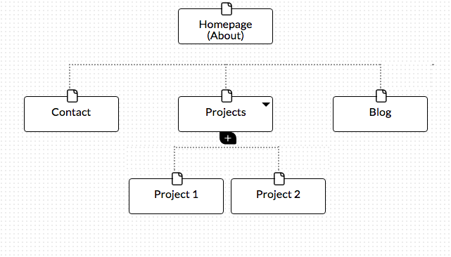

#What are the 6 Phases of Web Design?

Information Gathering
Planning
Design
Development
Testing and Delivery
Maintence

#What is your site's primary goal or purpose? What kind of content will your site feature?

My site's primary goal is to introduce myself, explain my goals, and track my DBC journey and projects. My site will feature an About Me page, a blog, current and upcoming projects, and links to my social media.

#What is your target audience's interests and how do you see your site addressing them?

My audience is primarily interested in learning what Dev Bootcamp is like and reading my perspective on the cohort. Using the blog, my site portrays the journey through Dev Bootcamp by talking about my experiences every week.

#What is the primary "action" the user should take when coming to your site? Do you want them to search for information, contact you, or see your portfolio? It's ok to have several actions at once, or different actions for different kinds of visitors.

Users should read my blog and hopefully contact me with any questions about my journey or projects.

#What are the main things someone should know about design and user experience?

You should understand your target audience. From there you can personalize the website towards their interests. The website should be very easy to navigate so you don't lose their interest. It should be very easy for your users to accomplish the goal you have set out for them on your site.

#What is user experience design and why is it valuable?

As I said before, user experience design makes it easy for your user to navigate through the website and find what they're looking for. It is valuable because, if the website isn't easy to navigate, you will lose users to better designed websites.

#Which parts of the challenge did you find tedious?
Being used to fancier websites, creating a basic HTML website without CSS was very tedious.